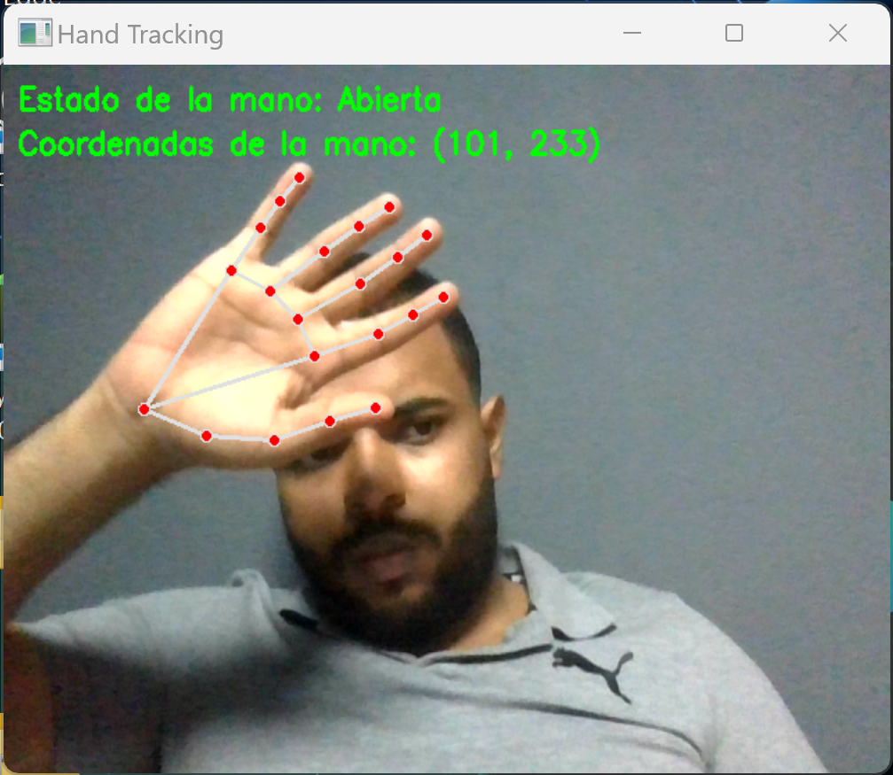

# Hand Tracking

## Descripción:
Desarrollé un emocionante proyecto de seguimiento de manos que utiliza las bibliotecas Mediapipe y OpenCV en Python. Este proyecto permite realizar un seguimiento en tiempo real de la mano frente a la cámara y utiliza los gestos para controlar el mouse de manera intuitiva.
## Demo


## Tecnologías Utilizadas:
- Python
- OpenCV
- Mediapipe
- PyAutoGUI
## Funcionalidades Principales:
- Seguimiento en Tiempo Real: La aplicación detecta la posición de la mano en tiempo real utilizando la detección de landmarks con Mediapipe.

- Control de Mouse: Mueve el cursor del mouse de acuerdo con los movimientos de la mano, brindando una experiencia interactiva y sin necesidad de hardware adicional.

- Interacción Gestual: Reconoce gestos específicos, como cerrar la mano para realizar clics izquierdos y abrir la mano para mantener el estado del mouse en reposo.

# Resultados y Logros:
Implementación exitosa de la detección de manos y gestos utilizando Mediapipe.
Integración fluida con OpenCV para el procesamiento de imágenes y la visualización en tiempo real.
Mejora de la experiencia del usuario al proporcionar una forma innovadora de controlar el mouse sin dispositivos externos.
Aprendizaje Continuo:
Como desarrollador Full-Stack, este proyecto me brindó la oportunidad de explorar la intersección entre visión por computadora, automatización y control de interfaz de usuario. Además, la experiencia me permitió perfeccionar mis habilidades en Python, OpenCV y Mediapipe, demostrando mi capacidad para adaptarme a tecnologías emergentes y crear soluciones creativas.

## Instalación

1. Clona este repositorio o descarga los archivos.

2. Abre una terminal y navega hasta el directorio del proyecto.

3. Crea un entorno virtual (opcional pero recomendado) en macOS y Linux o Windows:

    ```bash
    python3 -m venv venv
    ```
    ```bash
    py -m venv venv
    ```
4. Activa el entorno virtual:

    ```bash
    source venv/bin/activate
    ```
    ```bash
    venv\Scripts\activate
    ```
5. Instala los paquetes necesarios:

    ```bash
    pip3 install -r requirements.txt
    ```
    ```bash
    pip install -r requirements.txt
    ```
   
6. Ejecuta el script:

    ```bash
    python3 main.py
    ```
    ```bash
    py main.py
    ```
   
## Uso

- Para mover el mouse, mueve tu mano en el aire.
- Para hacer clic derecho, cierra la mano.


## Licencia

[MIT](https://choosealicense.com/licenses/mit/)

## Creado por Alejandro López
